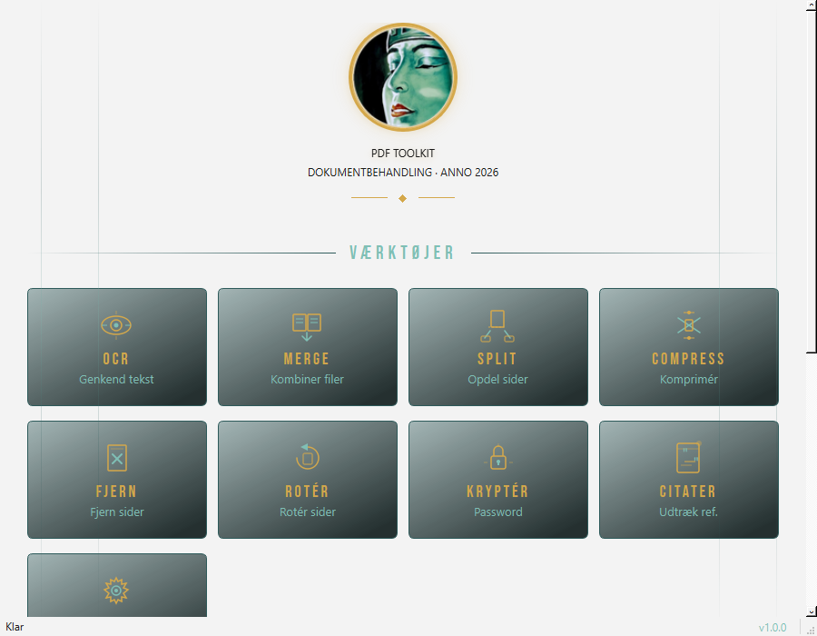

# PDF Toolkit


En simpel og hurtig desktop-applikation til PDF-manipulation med dansk sprogunderstøttelse.

**Metropolis Art Deco Theme** - Moderne UI inspireret af 1920'ernes Art Deco æstetik.



## Features

- **OCR Tekstgenkendelse** - Gør scannede dokumenter søgbare (dansk + engelsk)
- **Kombiner PDFs** - Saml flere PDF-filer til én
- **Opdel PDF** - Split i enkelte sider, sideintervaller eller lige dele
- **Komprimér PDF** - 3 niveauer (høj kvalitet, balanceret, maksimal)
- **Rotér sider** - 90°, 180°, 270° for alle eller specifikke sider
- **Fjern sider** - Visuel thumbnail-baseret sidevalg
- **Password beskyttelse** - AES-256 kryptering med bruger- og ejerkodeord
- **Citater** - Udtræk metadata fra akademiske PDFs (BibTeX/CSL-JSON)
- **Konverter Word til PDF** - DOCX til PDF konvertering

## Installation

### Forudsætninger

1. **Python 3.10+**
   ```powershell
   python --version
   ```

2. **Tesseract OCR** (til tekstgenkendelse)
   - Download fra: https://github.com/UB-Mannheim/tesseract/wiki
   - Vælg dansk sprogpakke under installation
   - Tilføj til PATH: `C:\Program Files\Tesseract-OCR`

   Eller download dansk sprogpakke separat:
   ```powershell
   # Download dan.traineddata til tessdata mappen
   curl -L -o "C:\Program Files\Tesseract-OCR\tessdata\dan.traineddata" "https://github.com/tesseract-ocr/tessdata/raw/main/dan.traineddata"
   ```

### Installer PDF Toolkit

```powershell
# Klon eller download projektet
git clone <repo-url> pdf-toolkit
cd pdf-toolkit

# Opret virtuelt miljø (valgfrit men anbefalet)
python -m venv venv
.\venv\Scripts\Activate

# Installer dependencies
pip install -r requirements.txt

# Kør applikationen
python run_app.py
```

## Brug

### Start applikationen
```powershell
cd pdf-toolkit
python run_app.py
```

Eller brug `run.bat` på Windows.

### Grundlæggende workflow

1. **Træk filer** ind i applikationen (eller klik for at vælge)
2. **Vælg værktøj** fra toolbaren (OCR, Merge, Split, etc.)
3. **Konfigurer indstillinger** i dialogen
4. **Kør operationen** og gem resultatet

## Konfiguration

### Tesseract sti
Hvis Tesseract ikke er i PATH, angiv stien i **Indstillinger**:
- Tesseract sti: `C:\Program Files\Tesseract-OCR\tesseract.exe`

### Tilgængelige sprog
```powershell
tesseract --list-langs
# Skal vise: dan, eng, osd
```

## Teknisk Stack

- **UI:** PyQt6
- **PDF Processing:** PyMuPDF (fitz)
- **OCR:** Tesseract + pytesseract
- **Image Processing:** Pillow

## Projektstruktur

```
pdf-toolkit/
├── run_app.py              # Launcher script
├── requirements.txt        # Python dependencies
├── src/
│   ├── main.py             # Application entry point
│   ├── ui/
│   │   ├── main_window.py  # Hovedvindue med responsivt grid
│   │   ├── styles.py       # Art Deco QSS tema
│   │   ├── icons.py        # SVG ikoner med pixmap-cache
│   │   ├── widgets/        # ToolTile, DropZone, FileList, Progress
│   │   └── dialogs/        # 10 dialog-vinduer (OCR, Merge, Split, etc.)
│   ├── core/               # PDF processing
│   │   ├── ocr_engine.py   # Tesseract OCR
│   │   ├── merger.py       # Kombiner PDFs
│   │   ├── splitter.py     # Opdel PDF (4 modes)
│   │   ├── compressor.py   # Komprimering (3 niveauer)
│   │   ├── page_ops.py     # Rotér/fjern sider
│   │   ├── encryption.py   # AES-256 kryptering
│   │   ├── citation_extractor.py  # Akademisk metadata
│   │   └── converter.py    # DOCX → PDF
│   └── config/             # Settings og konstanter
└── tests/                  # Unit tests
```

## Fejlfinding

### "Tesseract not found"
- Verificer installation: `tesseract --version`
- Tilføj til PATH eller angiv sti i Indstillinger

### OCR giver forkerte danske tegn
- Sikr dansk sprogpakke er installeret
- Vælg "Dansk" i OCR indstillinger

### QPainter errors i konsollen
- Kan ignoreres - påvirker ikke funktionalitet

## Licens

MIT License - Fri til brug og modifikation.

## Bidrag

Fejlrapporter og forbedringsforslag er velkomne!
